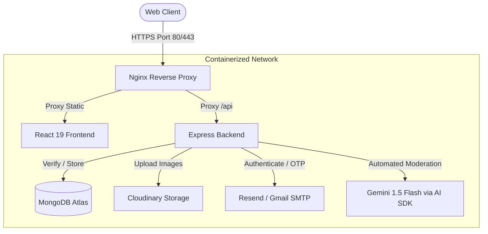

# CultureArc 🏛️ - Cultural Heritage Preservation Platform

CultureArc is a modern, full-stack digital preservation platform designed to archive and showcase historical and cultural artifacts. The application features automated AI-powered content moderation, secure 3-step OTP-based user onboarding, custom collection curation, and a comprehensive admin approval dashboard. 

The project is built using a microservices-inspired architecture, fully containerized with Docker, and orchestrated via Kubernetes.

---

## 🏗️ System Architecture

The following diagram illustrates the flow of request and system integration:



---

## ✨ Key Features

1. **AI-Driven Artifact Moderation**: Utilizes **Google Gemini 1.5 Flash** (via Vercel AI SDK) to analyze submitted artifact images, descriptions, titles, and eras. Submissions are auto-approved, auto-rejected, or flagged for human review based on AI confidence.
2. **Secure 3-Step Onboarding**: Wizard-based registration enforcing email ownership validation through 6-digit OTP codes and JWT session tokens.
3. **Curation & Collection Manager**: Users can create custom public or private thematic collections and add preserved artifacts to them.
4. **Interactive Explorations**: Debounced search and category filtering with a fluid visual UI, smooth page transitions, and dark/light modes.
5. **Admin Moderation Portal**: Dedicated administrator queue to manually review, approve, or reject pending submissions with feedback.

---

## 🛠️ Tech Stack

### Frontend
* **Core**: React 19, React Router v7
* **Build System & Tooling**: Vite
* **Styling**: Tailwind CSS v4, Lucide React (Icons)
* **Animations**: Framer Motion

### Backend
* **Runtime & Framework**: Node.js, Express
* **Database**: MongoDB (Mongoose ODM)
* **AI Integration**: Vercel AI SDK, `@ai-sdk/google` (Gemini)
* **Input Validation**: Zod Schemas
* **File Uploads**: Multer, Cloudinary Integration
* **Authentication**: JSON Web Tokens (JWT), BcryptJS

### DevOps & Infrastructure
* **Containerization**: Docker, Multi-stage Dockerfiles
* **Orchestration**: Kubernetes (K3s, deployment manifests)
* **CI/CD**: GitHub Actions (Dry-run Docker builds, dependency checks, and linting)

---

## 🚦 Getting Started

### Prerequisites
* [Docker](https://www.docker.com/) & [Docker Compose](https://docs.docker.com/compose/)
* [Node.js v20+](https://nodejs.org/) (for manual local execution)

### Quick Start (Docker Compose)
The easiest way to spin up the entire application locally is using Docker Compose:

1. Clone the repository:
   ```bash
   git clone https://github.com/PavanMeka09/CultureArc.git
   cd CultureArc
   ```

2. Configure environment variables. Copy the backend template:
   ```bash
   cp CultureArc-backend/.env.example CultureArc-backend/.env
   ```
   *Fill in the `.env` file with your MongoDB URI, Cloudinary tokens, Gmail/Resend keys, and Gemini API key.*

3. Spin up the containers:
   ```bash
   docker-compose up --build
   ```

4. Open [http://localhost](http://localhost) in your browser. The React frontend is mapped to port 80 and reverse proxies requests under `/api` to the backend on port 5000.

---

## 🔌 API Endpoints Summary

| Method | Endpoint | Description | Access |
| :--- | :--- | :--- | :--- |
| **POST** | `/api/users/initiate-signup` | Send OTP for email verification | Public |
| **POST** | `/api/users/verify-signup-otp` | Validate OTP and return signup session token | Public |
| **POST** | `/api/users/complete-signup` | Create user account with verified credentials | Public |
| **POST** | `/api/users/login` | Authenticate user and return JWT | Public |
| **GET** | `/api/users/profile` | Retrieve current user profile | Private |
| **GET** | `/api/artifacts` | Search and filter approved artifacts | Public |
| **POST** | `/api/artifacts` | Submit a new artifact (triggers AI review) | Private |
| **PUT** | `/api/artifacts/:id/status` | Approve or reject artifact | Private/Admin |
| **POST** | `/api/collections` | Create a new curation collection | Private |
| **POST** | `/api/upload` | Upload image to Cloudinary | Private |

---

## ☁️ Cloud Deployment & Orchestration

### Kubernetes Orchestration
Deployment files located in `k8s/deployment.yaml` manage scaling, secret storage, and high availability:
* **Secrets**: Stores base64-encoded environment credentials.
* **Deployments**: Configures replica count, rolling updates, image pull policies, and resource limits (CPU/Memory bounds).
* **Services**: Exposes the React frontend and Express backend using `LoadBalancer` load balancers.