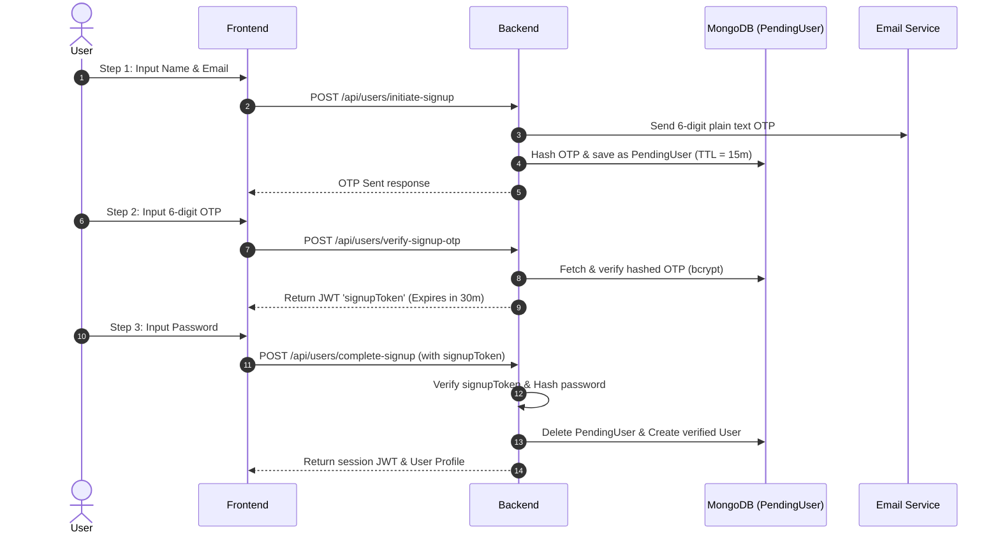

# CultureArc 🏛️ - TCS Prime Interview Prep Guide

This guide compiles a comprehensive, end-to-end breakdown of **CultureArc**, designed to help you explain the project from 0 to in-depth during your TCS Prime interview.

---

## 🧭 Executive Summary

**CultureArc** is a modern, full-stack digital preservation platform built to archive and showcase historical and cultural artifacts. 

### Key Selling Points for an Interview:
*   **AI-Powered Human-in-the-Loop Moderation**: Integrates Google Gemini 1.5 Flash to automatically approve, reject, or flag submissions for manual review based on confidence scores.
*   **Secure Onboarding Wizard**: A robust 3-step registration flow using 6-digit OTP codes, temporary JWT signup tokens, and MongoDB TTL (Time-To-Live) indexes for secure and clean state management.
*   **DevOps & Production-Ready Infrastructure**: Built with Docker multi-stage builds, an Nginx reverse proxy, and Kubernetes orchestrations with defined resource limits and secrets.

---

## 🏗️ System Architecture & Data Flow

CultureArc is structured as a containerized microservices-inspired application. 

```mermaid
graph TD
    User([Web Client]) -->|HTTPS Port 80/443| Nginx[Nginx Reverse Proxy]
    
    subgraph Containerized Network (Docker/Kubernetes)
        Nginx -->|Serves Static Files| FE[React 19 Frontend]
        Nginx -->|Proxies /api| BE[Express Backend]
        BE -->|Stores Metadata & Users| DB[(MongoDB Atlas)]
        BE -->|Uploads Images| Cloudinary[Cloudinary Storage]
        BE -->|Sends OTP Emails| Resend[Resend / Gmail SMTP]
        BE -->|Automated Moderation| Gemini[Gemini 1.5 Flash via Vercel AI SDK]
    end
```

### Component Breakdown
1.  **Frontend (React 19 & Vite)**: Single Page Application (SPA) styled with Tailwind CSS v4 and animated using Framer Motion.
2.  **Web Server / Proxy (Nginx)**: Acts as the ingress point. It serves the static React assets and reverse proxies API requests under `/api` to the backend.
3.  **Backend (Node.js & Express)**: RESTful API executing business logic, input validation (via Zod), and database operations (via Mongoose).
4.  **Database (MongoDB Atlas)**: NoSQL database storing users, temporary users, artifacts, and curation collections.
5.  **External Services**:
    *   **Cloudinary**: Cloud-based media storage for artifact images.
    *   **Gmail/Resend**: For sending OTPs during onboarding and password resets.
    *   **Google Gemini 1.5 Flash**: Multimodal AI checking the relevance, era, and appropriateness of submitted images and text.

---

## ⚡ Technical Deep Dives (Interview Highlights)

These three technical implementations will set you apart in a TCS Prime interview by showing you understand secure design, AI integration, and production-grade DevOps.

### 1. Secure 3-Step Onboarding with MongoDB TTL
To prevent spam, database bloating, and partial user records, CultureArc implements a wizard-based registration flow.



*   **MongoDB TTL Index**: The `PendingUser` schema uses a Time-To-Live index:
    ```javascript
    pendingUserSchema.index({ createdAt: 1 }, { expireAfterSeconds: 900 });
    ```
    This instructs MongoDB to automatically purge expired pending registrations after 15 minutes, preventing database bloat and stale records.
*   **Security Principle**: The OTP is hashed using `bcrypt` in the database, protecting it against database leaks. The final step is authorized by a short-lived `signupToken` containing the verified email, ensuring that the password cannot be set for an unverified email address.

---

### 2. Automated Multimodal AI Content Moderation
Rather than relying solely on manual admin review, CultureArc embeds automated AI moderation.

*   **Model**: Google Gemini 1.5 Flash via Vercel AI SDK (`@ai-sdk/google`).
*   **Logic**:
    1.  User uploads an artifact image to Cloudinary and submits details (Title, Description, Category, Era, Region).
    2.  The backend calls Gemini, passing the prompt and the Cloudinary image URL.
    3.  Gemini uses a structured Zod schema (`moderationSchema`) to return JSON:
        ```javascript
        {
          isAppropriate: boolean,
          confidence: number, // 0 - 100
          reason: string
        }
        ```
    4.  **Three-Tier Decision Engine**:
        *   **Auto-Approve**: `isAppropriate === true` and `confidence >= 70`.
        *   **Auto-Reject**: `isAppropriate === false` and `confidence >= 80`.
        *   **Pending (Human Review)**: If confidence is lower, the status stays `pending` for an admin to approve or reject via the Admin Moderation Portal.

---

### 3. Production DevOps (Docker Multi-stage & Nginx)
Showcasing how the application is optimized for container deployment is crucial.

*   **Multi-Stage Dockerfile (Frontend)**:
    ```dockerfile
    # Stage 1: Build React application
    FROM node:20-alpine AS builder
    WORKDIR /app
    COPY package*.json ./
    RUN npm install
    COPY . .
    RUN npm run build

    # Stage 2: Serve static files with Nginx
    FROM nginx:1.25-alpine
    COPY --from=builder /app/dist /usr/share/nginx/html
    COPY nginx.conf /etc/nginx/conf.d/default.conf
    EXPOSE 80
    CMD ["nginx", "-g", "daemon off;"]
    ```
    *Why Multi-Stage?* The `node:20-alpine` builder image contains dev dependencies, Vite tools, and source code, resulting in a large size (~400MB). Stage 2 copies only the optimized static folder (`dist`) into a lightweight `nginx:alpine` image (~25MB), drastically reducing security vulnerabilities and registry storage.

*   **Nginx Configuration**:
    Uses `try_files $uri $uri/ /index.html;` to delegate routing back to React Router (preventing 404s on page refresh). It also acts as an API gateway by forwarding `/api` requests directly to `http://backend:5000`.

---

## 🗄️ Database Schemas (Mongoose)

### 1. `User` Schema
Tracks primary authenticated user records.
*   `name`, `email` (unique, lowercase), `password` (hashed).
*   `isAdmin` (boolean, defaults to `false`).
*   `isVerified` (boolean, set to `true` upon OTP signup).
*   `resetPasswordToken`, `resetPasswordExpire` (for password reset flow).

### 2. `PendingUser` Schema
Holds temporary data during signup.
*   `name`, `email`.
*   `otp` (hashed version of the 6-digit OTP).
*   `otpExpires` (Date, expires in 15 minutes).
*   TTL index configured to self-delete in 900 seconds.

### 3. `Artifact` Schema
Stores artifact listings.
*   `title`, `description`, `imageUrl`, `category`, `era`, `region`.
*   `status`: enum `['pending', 'approved', 'rejected']`.
*   `aiReview`: Subdocument containing `isAppropriate`, `confidence`, `reason`, and `reviewedAt`.
*   `likes`: Array of user ObjectIds.
*   `comments`: Array of subdocuments containing `user`, `userName`, `text`, and `createdAt`.
*   `user`: ObjectId referencing the submitter.

---

## 💬 Mock Interview Q&A (TCS Prime Level)

Here are the exact questions an interviewer might ask when reviewing this project, and how you should answer them.

### Q1: Why did you split the signup process into 3 steps instead of a simple registration page?
> **Answer**: 
> "By splitting the signup flow, we achieve three things:
> 1. **Security**: We verify email ownership *before* the user can set a password, preventing users from creating fake accounts with emails they don't own.
> 2. **Clean Database State**: We store unverified users in a temporary `PendingUser` collection rather than the main `User` collection. If a signup is abandoned halfway, MongoDB's TTL index automatically deletes the document after 15 minutes, avoiding bloat.
> 3. **Better UX**: The multi-step wizard breaks down form inputs, making it less overwhelming for users."

---

### Q2: How does the AI content moderation work, and what happens if the Gemini API key is missing or fails?
> **Answer**:
> "We use Google Gemini 1.5 Flash via the Vercel AI SDK to perform multimodal moderation. When a user submits an artifact, the backend sends the text metadata and the Cloudinary image URL to the Gemini model, which evaluates it using a structured Zod schema. 
> To ensure system reliability:
> *   If the API key is missing (e.g., local development), the system defaults to auto-approving submissions.
> *   If the API call fails during production, the backend catches the error, logs it, and sets the artifact status to `pending`, routing it to the human admin moderation queue. This prevents an API outage from breaking the main application flow."

---

### Q3: What is a Multi-stage Docker build, and why did you use it for the frontend?
> **Answer**:
> "A Multi-stage Docker build allows us to use multiple `FROM` instructions in a single Dockerfile. 
> In Stage 1, we use a Node.js image to install packages and build the React app into static files (`dist`). 
> In Stage 2, we discard the Node.js runtime and source code, starting fresh from a lightweight Nginx alpine image. We only copy the built static files from Stage 1 into the Nginx HTML directory. 
> This approach keeps our production image extremely small (from ~400MB down to ~25MB), improves security by removing package managers and raw source code from the final image, and accelerates deployment times."

---

### Q4: How does Nginx handle client-side routing in this single page application?
> **Answer**:
> "In React SPAs, routing is handled on the client side by React Router. When a user navigates to a route like `/explore`, the browser doesn't request a new file from Nginx; React Router intercepts it.
> However, if the user refreshes `/explore`, the browser requests `/explore` directly from Nginx. Since Nginx has no such file, it would normally return a 404 error.
> To fix this, we configured Nginx with:
> `try_files $uri $uri/ /index.html;`
> This tells Nginx to look for the file or directory, and if it doesn't exist, fallback to serving `index.html`. React Router then reads the URL and renders the correct page on load."

---

### Q5: How would you scale this application to support millions of users?
> **Answer**:
> "To scale CultureArc, I would implement the following:
> 1. **Database Scaling**: Implement read replicas in MongoDB Atlas to scale read operations. Add indexes on frequently queried fields like `title`, `category`, and `status`.
> 2. **Caching**: Place a Redis caching layer in front of the backend to cache static data like approved artifacts and public collections, reducing DB query load.
> 3. **Kubernetes Scaling**: Increase backend pod replicas and configure a Horizontal Pod Autoscaler (HPA) to scale pods dynamically based on CPU/Memory usage.
> 4. **CDN**: Place Cloudflare or Cloudinary's CDN in front of the frontend assets and artifact images to cache media at edge locations globally."
